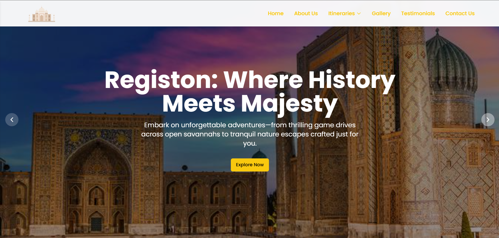
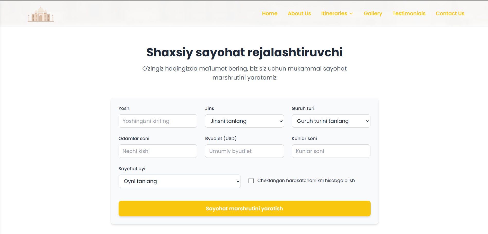
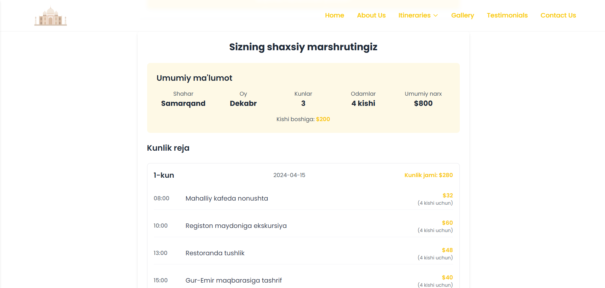
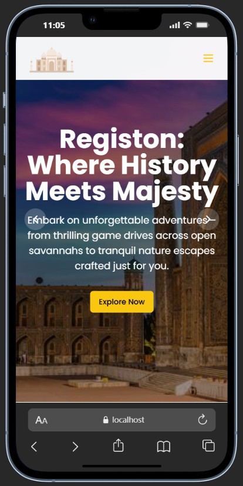

# Online Tourism Website

This project is a modern tourism website built with React, TypeScript, and Vite, featuring a responsive design and interactive user interface.

## 🚀 Features

- Modern and responsive design
- Interactive user interface
- Tourism package showcases
- Mobile-friendly navigation
- Image galleries
- Toast notifications
- Tooltip components
- Custom hooks for mobile responsiveness

## 🛠 Technologies Used

- React 18
- TypeScript
- Vite
- Tailwind CSS
- Bun (Package Manager)
- ESLint
- PostCSS

## 📸 Screenshots

### Home Page



### Destinations



### Tour Packages



### Mobile View



## 🚀 Getting Started

### Prerequisites

- Node.js (v16 or higher)
- Bun (latest version)

### Installation

1. Clone the repository:

```bash
git clone https://github.com/Numonov01/Online-tour-agent.git
```

2. Install dependencies:

```bash
bun install
```

3. Start the development server:

```bash
bun run dev
```

The application will be available at `http://localhost:5173`

## 🔧 Available Scripts

- `bun run dev` - Start development server
- `bun run build` - Build for production
- `bun run preview` - Preview production build
- `bun run lint` - Run ESLint

## 📱 Responsive Design

The website is fully responsive and optimized for:

- Desktop devices
- Tablets
- Mobile phones

## 🤝 Contributing

1. Fork the repository
2. Create your feature branch (`git checkout -b feature/AmazingFeature`)
3. Commit your changes (`git commit -m 'Add some AmazingFeature'`)
4. Push to the branch (`git push origin feature/AmazingFeature`)
5. Open a Pull Request

## 📝 License

This project is licensed under the MIT License - see the [LICENSE](LICENSE) file for details.

## 👨‍💻 Author

- GitHub: [@Numonov01](https://github.com/Numonov01)
